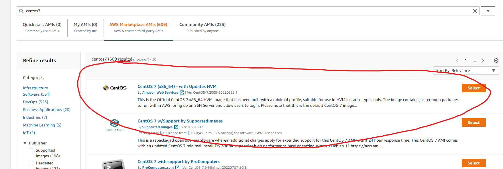
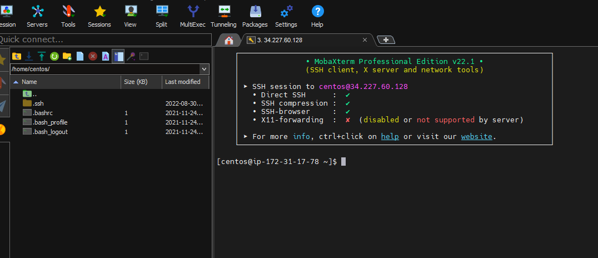

## Creating an AWS EC2 instance

### Creating an instance using the AWS dashboard
- Navigate to [aws.amazon.com](https://aws.amazon.com/)
- Sign in to your user account
- In the search bar type `ec2` and press the EC2 option in search results

- Press the **Launch instance** button

- Name your instance something relevant to you e.g. (RNAseq Processing)
- Under **Application and OS Images** enter `centos7` into the search bar
- Initially, 0 results will be returned. Wait a few seconds and search results should populate your screen
- Select the top result titled **CentOS7 (x86_674) - with Updates HVM**

- Press **Continue**
- Select your instance type
	- Note: it is critical that you select the processor and memory size needed for the jobs you plan on running. If you select an undersized instance, you will need to create a new one from scratch and if you select one that is substantially oversized it will incur a greater cost. 
		- Still, it is best to have one that is too big rather than too small
	- For something like RNAseq mapping **M4.4xlarge** is a good instance size with 16 vCPUs and 64 GB of memory
- Under Key pair (login), press **Create new key pair**
- A key pair wizard will open up
- Give it a key pair name such as AWS_key
- Ensure the Key pair type RSA box is checked
- Use the .pem key file format
- Press **Create key pair**

- The key pair file will automatically be downloaded into your Downloads directory
- The key pair name will automatically populate the Key pair name dropdown window
- Under Firewall (security groups):
	- ensure that **Create security group** is selected
- Check the box for **Allow SSH traffic from**
- Change the dropdown menu that says Anywhere 0.0.0.0/0 to:
		Custom
		130.199.0.0/16
- Ensure that the **Allow HTTPs traffic from internet** & **Allow HTTP traffic from the internet** boxes are **NOT** checked
	- These options are unnecessary for doing computational work and pose a security risk to your instance
	- There are some situations where it is useful to allow HTTP and HTTPs traffic, but you need special permission from ITD to do this

- Under Configure storage, change the root volume to the size of hard drive you anticipate needing for your project
	- Note: it is possible to exand your hard drive after the instance is created, but it is more difficult than picking the correct volume at the beginning
	- 2 TB is a good size for data processing, but will not be big for processing large datasets and simultaneously storing all intermediate files
	- Anything **>2 TB** will have to reformated after the instance is created. This can be confusing so only add more than 2 TB if needed

- Press the **Launch instance** button
- Press the **View all instances** button
- You should see a screen that looks like this:

- Ensure that the instance you created says **Running** under **Instance state** and that the status check says **2/2 checks passed**
- Expand the **Advanced details** menu at the bottom of the screen

- Under **IAM instance profile** change the dropdown menu to **s3Admin**
- Under **Detailed CloudWatch monitoring** change the dropdown menu to **enable**

## SSH into your instance (Mac)
- Ensure you are on BNL's VPN
- Open up your instance's login information by checking the box next to your instance's name and pressing connect in the top, right corner

- Press the SSH client tab
- Keep this page open on a separate tab. We will come back to it later

- Open up the terminal app on your mac
- Go to your Downloads directory and move the key pair name file you created when making your EC2 instance to a permanent directory where you can easily find it
	- Note: in this example, we named our key pair name "AWS_key.pem" and place it in the Documents directory
- Navigate into the directory that contains your key pair name

        cd Documents

	- Note: in this example, it will be in my Documents directory
- Change the file permission of your key pair name file so that it is not publicly viewable
		chmod 400 AWS_key.pem

- Use the following command as a template to SSH into your instance:
	- Note that you will need to change the key name: "AWS_key.pem" to reflect the name of the key you created and you will also need to copy instance Public DNS from your EC2 login information obtained
	- You should be able to simply copy the example from the EC2 connect window we opened previously on a separate tab

			ssh -i "AWS_key.pem" centos@ec2-34-227-60-128.compute-1.amazonaws.com
- You may be prompted that the host key is not cached for this server. This is fine, you can accept this warning and continue logging into the instance

## SSH into your instance (PC)
- Ensure you are on BNL's VPN
- Go to your Downloads directory and move the key pair name file you created when making your EC2 instance to a permanent directory where you can easily find it
	- Note: in this example, we named our key pair name "AWS_key.pem"
- Download the free version of [MobaXterm](https://mobaxterm.mobatek.net/download.html)
- Once downloaded and installed, press the session button in the top, left corner. This will open a separate connection wizard window
- Press the SSH Icon in the top, left corner of the new window

- Copy the Public IPv4 ip address from your instance. This is found on your EC2 dashboard

- Paste the IP address in the Remote host box in the MobaXterm window
- Press the Advanced SSH settings tab
- Check the Use private key box
- Click the file icon in the private key dropdown menu to select the private key that you created when creating your instance
- Navigate to the directory where you placed your key pair name file (ex: AWS_key.pem) and select that file
- Press the OK button

- MobaXterm will now try to connect to the instance
- If you are successful, you will see a prompt that says `login as:`

- If you used CentOS7 as the operating system, type in `centos` and press enter
- If successful, you should see a prompt that looks like this:

- If your instance rejects your username you can check your login information by pressing the connect button on your EC2 dashboard

- Check the public IP address and user name included here. 
	- If your User name is different than `centos`, change it to `centos` then repeat the MobaXterm login steps

## (OPTIONAL) Expand storage for instances that are >2 TB ##
- Note: this is required if your instance is >2 TB, otherwise you will not be able to use all of the storage that you allotted to your instance
- Check to see how your hard drive is partitioned by running the following command:
		lsblk

- You should see something that looks similar to this:

		[centos@ip-172-31-87-133 ~]$ lsblk
		NAME    MAJ:MIN RM  SIZE RO TYPE MOUNTPOINT
		xvda    202:0    0  3.9T  0 disk
		└─xvda1 202:1    0    2T  0 part /

- Notice that you have 4 TB of total space but only 2 TB are allocated to the root partition, "xvda1"
- You will need to make a note of the disk and partition to use in later steps in our case:
	- Disk: "xvda"
	- Partition: "xvda1"
- Use the gdisk tool to change the partition table
		sudo gdisk /dev/xvda

- You will see something similar to the following:
		[centos@ip-172-31-87-133 ~]$ sudo gdisk /dev/xvda
		GPT fdisk (gdisk) version 0.8.10

		Partition table scan:
		MBR: MBR only
 		BSD: not present
  		APM: not present
  		GPT: not present

		***************************************************************
		Found invalid GPT and valid MBR; converting MBR to GPT format
		in memory. THIS OPERATION IS POTENTIALLY DESTRUCTIVE! Exit by
		typing 'q' if you don't want to convert your MBR partitions
		to GPT format!
		***************************************************************

		Command (? for help):

- Enter the following commands to create a GPT partition:
		Command (? for help): n                                                                                                        
		Partition number (2-128, default 2): 128                                                                               
		First sector (34-6291455966, default = 4294967296) or {+-}size{KMGTP}: 34                     
		Last sector (34-2047, default = 2047) or {+-}size{KMGTP}:                                                  
		Current type is 'Linux filesystem'
		Hex code or GUID (L to show codes, Enter = 8300): ef02                                                     
		Changed type of partition to 'BIOS boot partition'

- Enter the following commands to delete the root partition:
		Command (? for help): d                                                                                                         
		Partition number (1-128): 1

- Enter the following commands to recreate the root partition:
		Command (? for help): n                                                                                                         
		Partition number (1-128, default 1): 1                                                                                     
		First sector (2048-6291455966, default = 2048) or {+-}size{KMGTP}:                                  
		Last sector (2048-6291455966, default = 6291455966) or {+-}size{KMGTP}:                       
		Current type is 'Linux filesystem'
		Hex code or GUID (L to show codes, Enter = 8300):                                                             
		Changed type of partition to 'Linux filesystem'

- Enter the following commands to save the GPT partition table:
		Command (? for help): w                                                                                                        
		Final checks complete. About to write GPT data. THIS WILL OVERWRITE EXISTING
		PARTITIONS!!
		Do you want to proceed? (Y/N): y                                                                                          
		OK; writing new GUID partition table (GPT) to /dev/xvda.
		The operation has completed successfully.

- Expand the file system
		sudo mount -o nouuid /dev/xvda1 /mnt
		sudo xfs_growfs /dev/xvda1

- Run the following commands **(Note: Run commands 1 by 1 to avoid mistakes!)**:
		sudo mount --bind /proc /mnt/proc
		sudo mount --bind /sys /mnt/sys
		sudo mount --bind /dev /mnt/dev
		sudo chroot /mnt /bin/bash
		grub2-install /dev/xvda
		exit
		sudo umount -l /mnt/dev
		sudo umount -l /mnt/sys
		sudo umount -l /mnt/proc
		sudo umount -l /mnt

- Using the AWS EC2 page on your browser, stop your instance
- Once your instance as stopped, start it again
- SSH into your instance. **Note: it will have a new IP address!**
- Run the following command to check that the full volume has been utilized:
		lsblk

- It should look something like this:
		$ lsblk
		NAME    MAJ:MIN RM SIZE RO TYPE MOUNTPOINT
		xvda    202:0    0   4T  0 disk 
		└─xvda1 202:1    0   4T  0 part /

## Install required packages
- Crowdstrike must be installed on all instances. This is a BNL requirement. 
- To install Crowdstrike on CentOS7
- install wget and nano
		sudo yum install -y wget nano
- On your local machine, download the latest Crowdstrike .rpm file from [https://mirror.bnl.gov/software/cyber/Crowdstrike/RHEL/](https://mirror.bnl.gov/software/cyber/Crowdstrike/RHEL/)
	- You must be on the VPN for this link to work
- For this exercise, we will download **crowdstrike_rhel9.rpm** onto our local machine
- Open up a new terminal window on your machine
- Navigate to the directory where your .pem file is located
		cd Documents
	- Transfer the .rpm file to your instance. In your new terminal window use the following command
		 	scp -i "AWS_key.pem" ~/Downloads/crowdstrike_rhel9.rpm centos@ec2-34-227-60-128.compute-1.amazonaws.com:/home/centos/
- To install the downloaded package
		sudo yum install -y crowdstrike_rhel9.rpm
- To activate the Crowdstrike license, copy the customer id from the following link:
- [https://bitwarden.itd.bnl.gov/#/send/QQnq4C0o4U6-Rq8AAS5IKg/NXfWv6lohf6rhRBSiiuEOw](https://bitwarden.itd.bnl.gov/#/send/QQnq4C0o4U6-Rq8AAS5IKg/NXfWv6lohf6rhRBSiiuEOw)
		sudo /opt/CrowdStrike/falconctl -s --cid=BAEDD79F134B412F9048B04C3705D12F-05
- Start the service
		sudo service falcon-sensor start
- Enable the service at boot
		sudo systemctl start falcon-sensor
- To confirm the sensor is running, run the following command
		ps -e | grep falcon-sensor
- You should see an output like this:
		16242 ?        00:00:05 falcon-sensor
